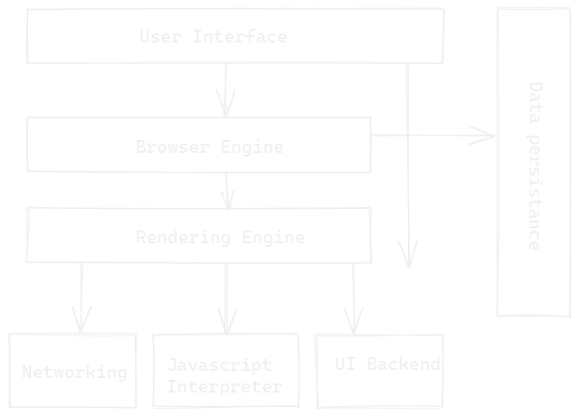
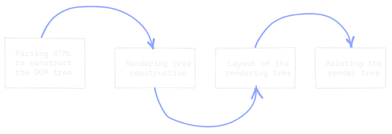

    <h1 align="center">Working of a browser</h1>
    <strong>
        Understanding how the browser works under the hood
    </strong>
    

        When a user enters an URL in the browser, how does the browser fetch the desired result? Explain this with the below in mind and Demonstrate this by drawing a diagram for the same.
    

## What is the main functionality of the browser?

With respect to the user, browser is a software application used to access information on the world wide web.
When a user requests some information, the web browser fetches the data from a web server and then displays the webpage on the user’s screen. It also gives additional functionality like, allowing to open multiple webpages at the same time and options like back, forward, reload, stop reload, home etc.

## High Level Components of a browser

### a) User Interface

Everything that the user can see which cannot be manipulated. For example, Address bar, settings, previous and next button, bookmark button, etc.

### b) Browser engine

Based on the inputs from various user interfaces, it queries and manipulates the Rendering engine.

### c) Rendering engine

this component is responsible for rendering a specific web page requested by the user on their screen.

### 4. Data persistence

### LocalStorage SessionStorage
    These web storage objects are simple key/value pairs. What’s interesting about them is that the data survives a page refresh (for sessionStorage) and even a full browser restart (for localStorage)

    They have a lot more storage capacity than cookies cause they are not sent to servers in the headers. Most browsers have 5 megabytes (can be extended).

    Both storage objects provide the same methods and properties:

    setItem(key, value) – store key/value pair.
    getItem(key) – get the value by key.
    removeItem(key) – remove the key with its value.
    clear() – delete everything.
    key(index) – get the key on a given position.
    length – the number of stored items.

### Cookies

    Same as localStorage, cookies also are storage objects with key/value pairs. They are somewhat special as they are attached to the HTTP request headers. So they can be helpful if the servers might need to use those cookies data. Cookies give you a limit of 4kb limit.

    It’s good for data such as user preferences that the server might need to run an operation.

### IndexedDB

    This is the most complex browser storage of the three. It’s like a browser database. it lets you create web applications with rich query abilities regardless of network availability, your applications can work both online and offline.

    So this is really useful for applications that need to persist really complex data for example games, calendars, google word documents, etc

### 5. Networking

Retrieves the URLs using the common internet protocols of HTTP or FTP. Handles all aspects of Internet communication and security.

### 6. Javascript interpreter

The engine is the part that reads and executes source code. Each major browser vendor has its own engine. Mozilla Firefox has Spidermonkey, Microsoft Edge has Chakra/ChakraCore and Apple Safari names its engine JavaScriptCore. Google Chrome uses V8, which is also the engine of Node.js.
The release of V8 in 2008 marked a pivotal moment in the history of engines. V8 replaced the browser’s relatively slow interpretation of JavaScript.

The reason behind this massive improvement lies mainly in the combination of interpreter and compiler. Today, all four engines use this technique.
The interpreter executes source code almost immediately. The compiler generates machine code which the user’s system executes directly.

As the compiler works on the machine code generation, it applies optimisations. Both compilation and optimisation result in faster code execution despite the extra time needed in the compile phase.

The main idea behind modern engines is to combine the best of both worlds:

Fast application startup of the interpreter.
Fast execution of the compiler.

Achieving both goals starts off with the interpreter. In parallel, the engine flags frequently executed code parts as a “Hot Path” and passes them to the compiler along with contextual information gathered during execution. This process lets the compiler adapt and optimise the code for the current context.

We call the compiler’s behaviour “Just in Time” or simply JIT.
When the engine runs well, you can imagine certain scenarios where JavaScript even outperforms C++. No wonder that most of the engine’s work goes into that “contextual optimisation”.

### 7. UI backend

## Rendering engine and its use

As the name suggests, this component is responsible for rendering a specific web page requested by the user on their screen. It interprets HTML and XML documents along with images that are styled or formatted using CSS, and a final layout is generated, which is displayed on the user interface.

## Parsers (HTML, CSS, etc)

The browser parses HTML into a DOM tree. HTML parsing involves tokenization and tree construction. HTML tokens include start and end tags, as well as attribute names and values. If the document is well-formed, parsing it is straightforward and faster. The parser parses tokenized input into the document, building up the document tree.

When the HTML parser finds non-blocking resources, such as an image, the browser will request those resources and continue parsing. Parsing can continue when a CSS file is encountered, but script tags—particularly those without an async or defer attribute—blocks rendering

When the browser encounters CSS styles, it parses the text into the CSS Object Model (or CSSOM), a data structure it then uses for styling layouts and painting. The browser then creates a render tree from both these structures to be able to paint the content to the screen. JavaScript is also downloaded, parsed, and then executed.

JavaScript parsing is done during compile time or whenever the parser is invoked, such as during a call to a method.

## Tree construction

To construct the render tree, the browser roughly does the following:

1) Starting at the root of the DOM tree, traverse each visible node.

    a) Some nodes are not visible (for example, script tags, meta tags, and so on),        and         are     omitted since they are not reflected in the rendered output.
    b) Some nodes are hidden via CSS and are also omitted from the render tree; for example, the span node---in the example above---is missing from the render tree because we have an explicit rule that sets the "display: none" property on it.
    
2) For each visible node, find the appropriate matching CSSOM rules and apply them.

3) Emit visible nodes with content and their computed styles.

## Layout and Painting

The changes made by Javascript, CSS animations, and web animation API will impact the further pipeline in the above diagram. Once there is a change, the browser must recalculate the styles of the elements that were affected, then the browser has to check all the other elements and then reflow the page. The affected areas need to be repainted, and the final painted elements will need to be composited back together.
